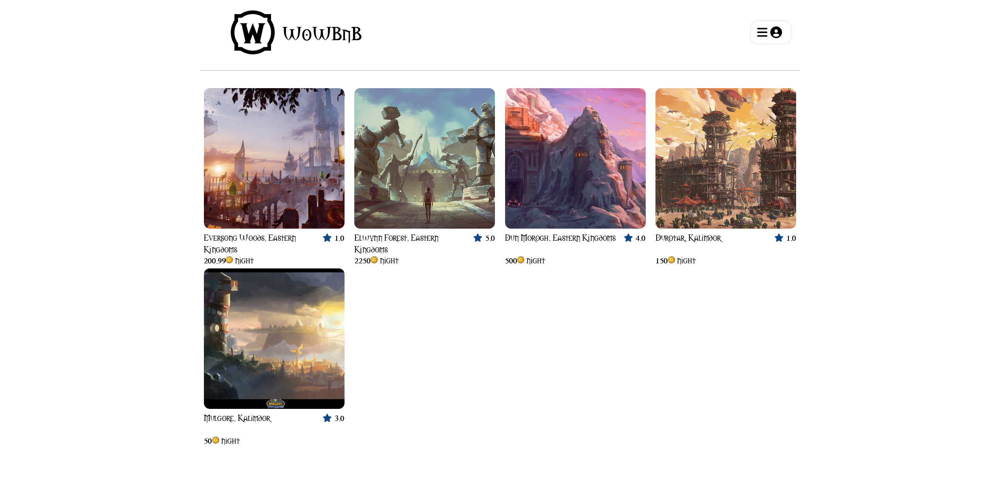
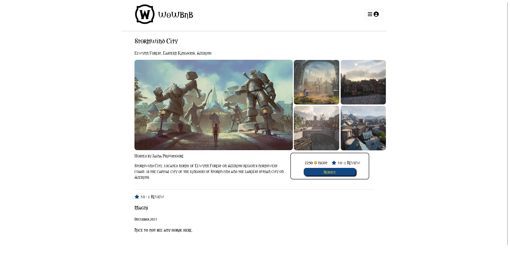
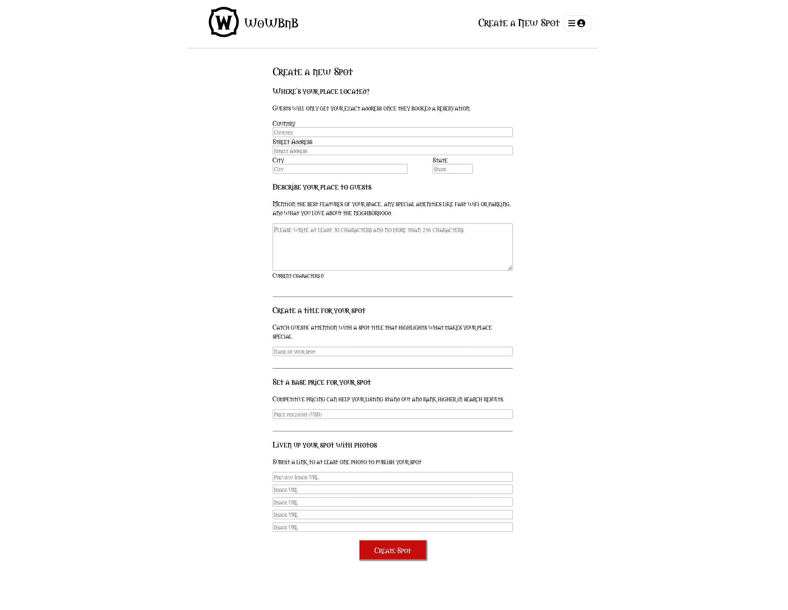
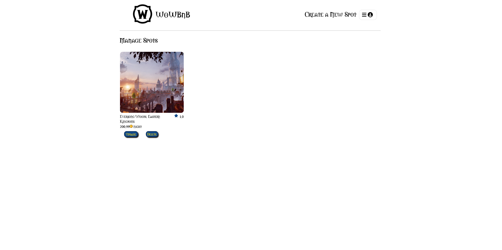

# WoWBnb

A platform modeled after Airbnb, this website mirrors key features of Airbnb, enabling users to add, modify, and remove listings. Its user interface is thoughtfully designed to be redundant yet user-friendly, providing a seamless and intuitive navigation experience.

# Live Link
**Click on the link below to visit the live site!** 

# Tech Stack
## Frameworks and Libraries

  
  
  
  
  
  
  

## Database

  

## Hosting

  

<h1>Landing Page</h1>
  
<h1>Spot Detail Page</h1>
  
<h1>Form Page</h1>
  
<h1>Manage Spot Page</h1>
  

# Feature Implementation Goal
1. Implement booking feature
2. Integrate Google Map
3. Integrate Goole Sign-in
